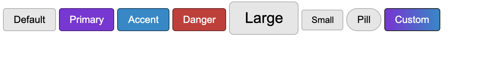

# css-button-component-library
Learning Practice and Note from Kyle Cook

## note

### box-sizing: border-box;
Select all(*) apply box-sizing to make sure if we assign "height" and "width" that will be the real size, not affect by padding and border

### .btn.otherbtnclass
btn is the base class, as we know CSS is read from top to bottom, so if we give a selector higher specificity like that, it have less chance to be rewrite by other.

### box-shadow: 0 0 5px 0  hsl(200, 100%, 20%);
check browser inspect->(right click button)force state->:hover-> Styles-> related position you can check more clear info
box-shadow: X-offset Y-offset Blur Spread Color
### basic button padding and border-radius use "em" unit
more easily to create same shape large/small button based on the basic button, just change font-size to another "rem"

### curser: pointer
add little hand pointer when curser at a button

### background: linear-gradient(to right, hsl(271, 70%, 50%), hsl(200, 100%, 40%));
make linear-gradient effect color background
